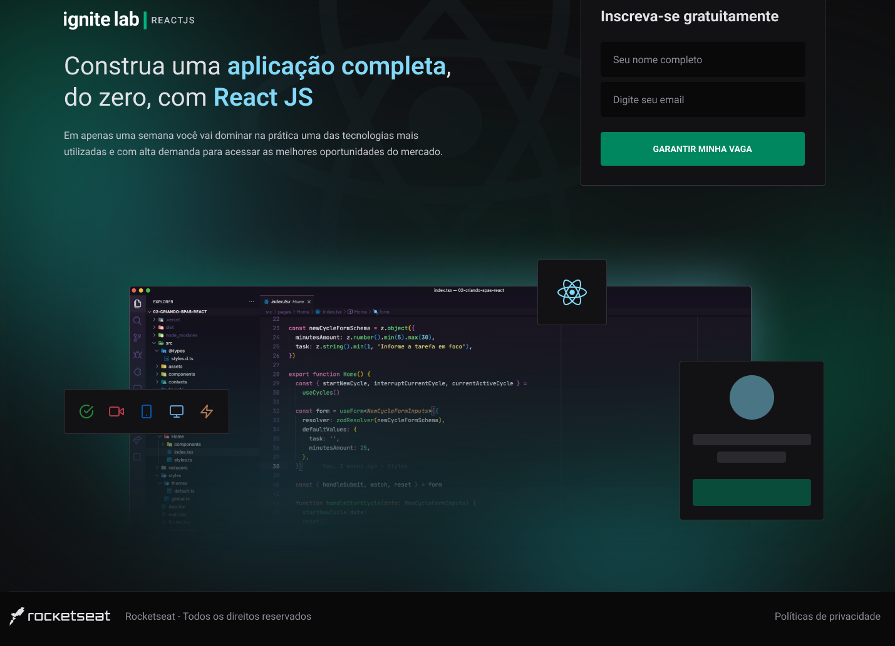

<h2 align="center">
  

    
  

</h2> 

  

  

  

  

  

figma: https://www.figma.com/file/OdbB5gOnJEDAvVR42zvXRn/Plataforma-de-evento---Ignite-Lab-(Community)?node-id=24%3A904

tailwindcss:  https://tailwindcss.com/

Graphcms: https://app.graphcms.com

By Gelzieny R. Martins 👋🏽 Find me:

<h2 id="license"> 📝 License </h2>

This project is under the MIT license.